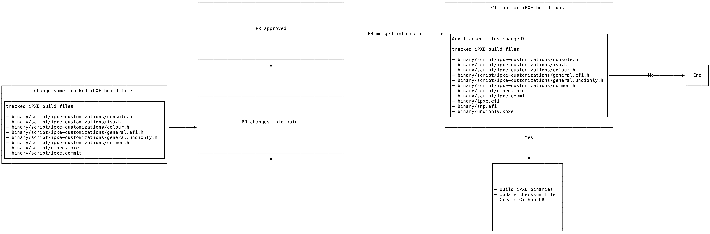

# Building iPXE binaries in the Open

One of the goals of this project is to be a Go library for serving custom build iPXE binaries.
To accomplish this, we need to embed the iPXE binaries into the source code.
This is done through Go's `embed` [library](https://pkg.go.dev/embed) package.
One of the challenges to accomplishing this goal, in an open and transparent way, is we need to build the custom iPXE binaries in the Open.

This document describes how we build the iPXE binaries in the Open.

1. Developer changes a tracked iPXE file.
    - Tracked files include:
        - binary/script/ipxe-customizations/console.h
        - binary/script/ipxe-customizations/isa.h
        - binary/script/ipxe-customizations/colour.h
        - binary/script/ipxe-customizations/general.efi.h
        - binary/script/ipxe-customizations/general.undionly.h
        - binary/script/ipxe-customizations/common.h
        - binary/script/embed.ipxe
        - binary/script/ipxe.commit
2. Developer PR's the change into the main branch.
3. The PR is approved and merged into the main branch.
4. A CI job runs that:
    - Checks if any tracked files or iPXE binaries (ipxe.efi, snp.efi, undionly.kpxe) have changed.
    - If no files have changed, the CI job exits.
    - If files are found to have changed:
        - Build the iPXE binaries.
        - Update the checksum file.
        - Commit the changes to a new branch.
        - PR the branch to the main branch.
5. The PR is approved and merged into the main branch.

See the diagram below for a visual representation of the follow.

